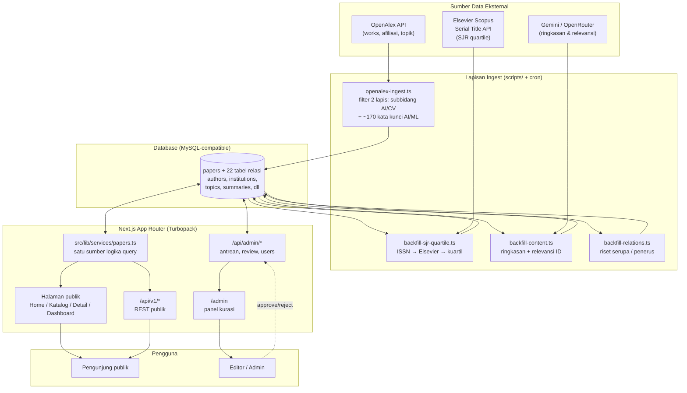
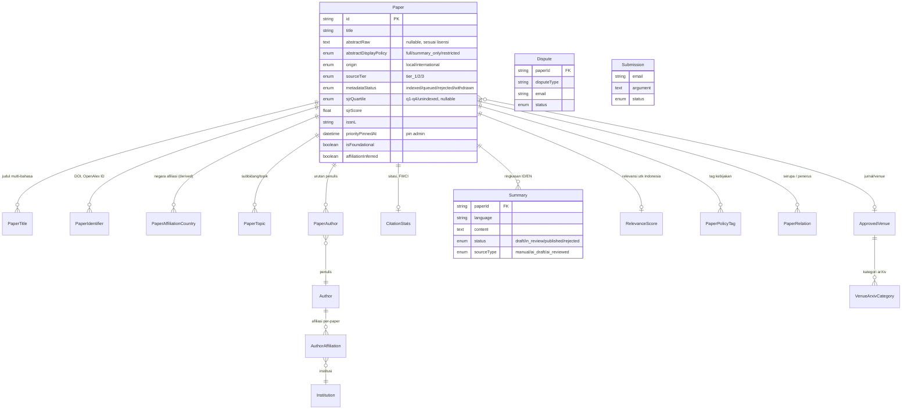
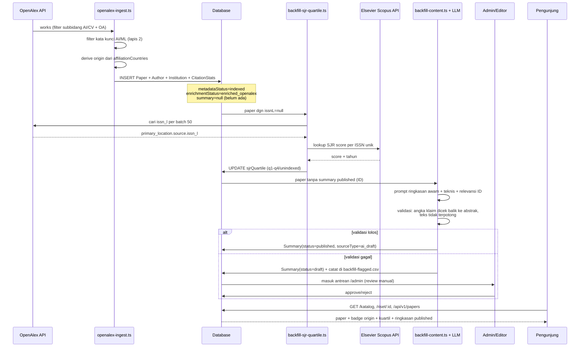
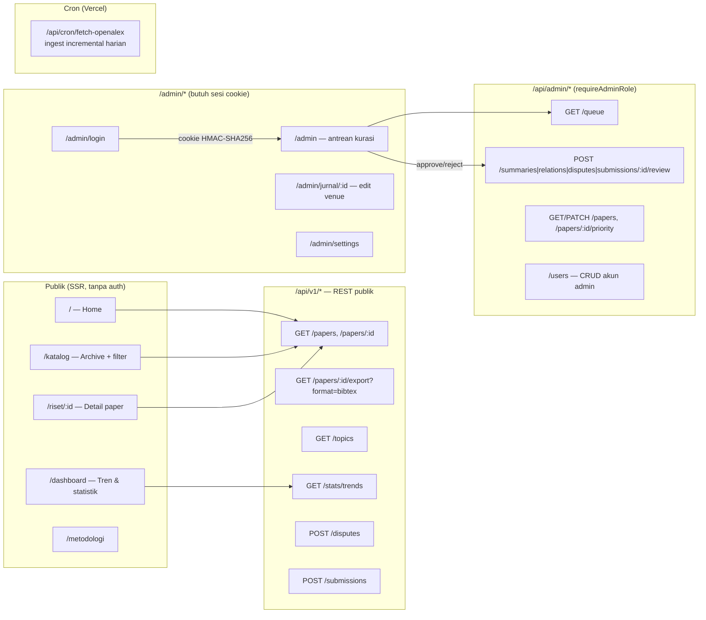
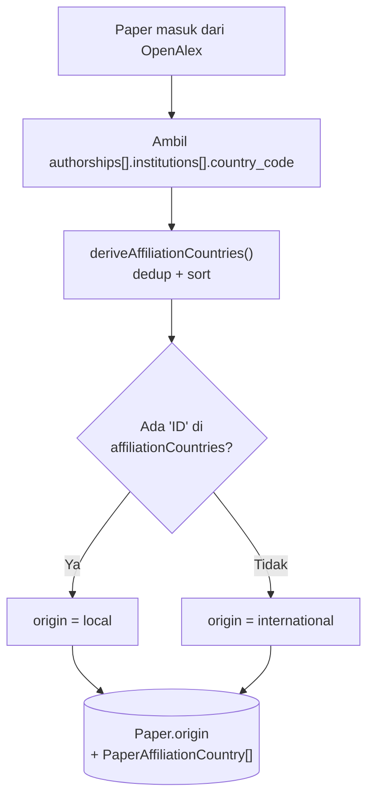
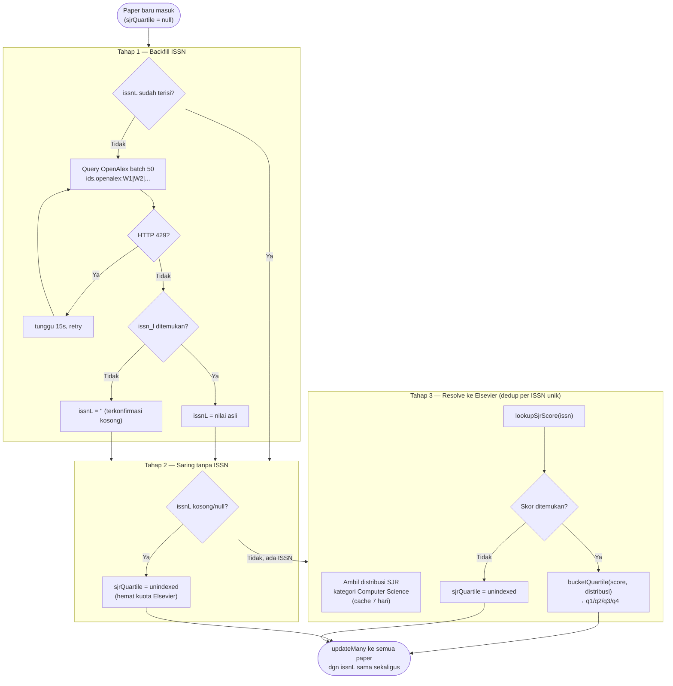
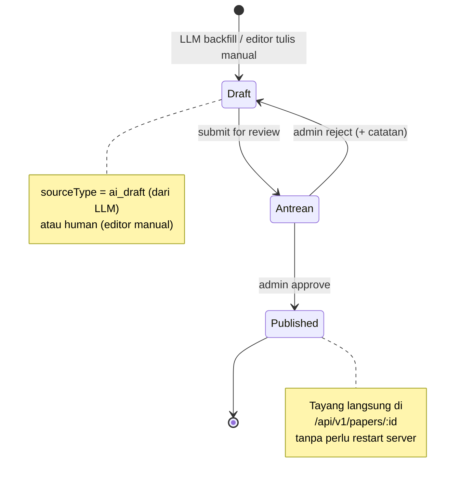
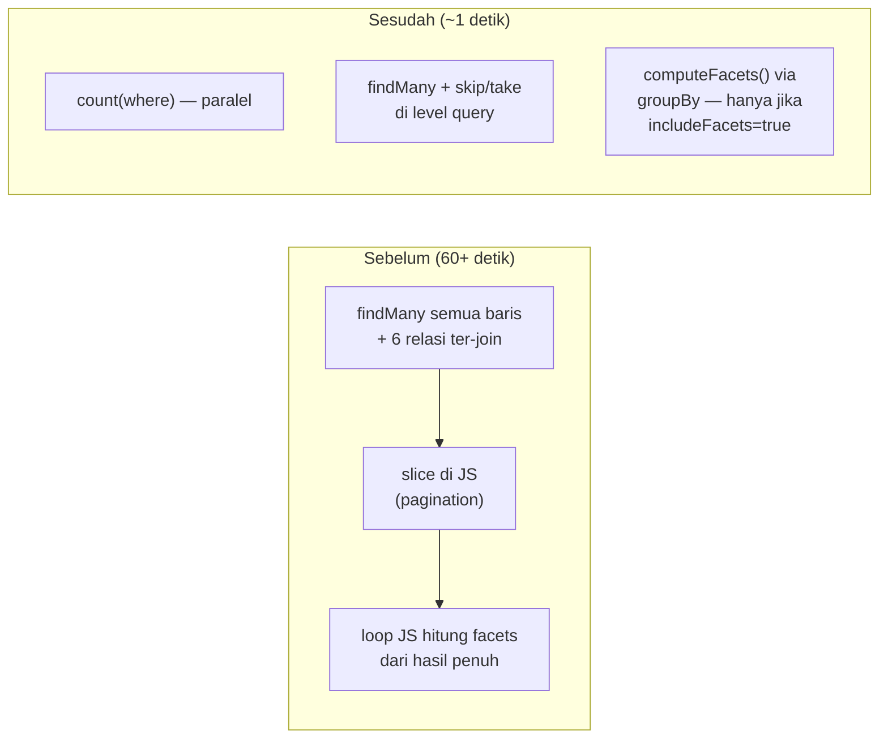

# PusatRiset.ai — Prototype

Katalog + lapisan interpretasi untuk riset AI Indonesia & internasional: agregasi paper dari
OpenAlex, klasifikasi asal (lokal vs internasional) berdasarkan afiliasi penulis, kuartil jurnal
SJR/Scopus, ringkasan berbahasa Indonesia (dibantu LLM, ditinjau editor), dan panel admin untuk
kurasi konten. Lihat [BUILD_SPEC_Prototype_PusatRiset_ai.md](./BUILD_SPEC_Prototype_PusatRiset_ai.md)
dan [PATCH_v1_BuildSpec_Prototype.md](./PATCH_v1_BuildSpec_Prototype.md) untuk spesifikasi awal
lengkap (bahasa spec, sebagian sudah berevolusi — README ini mengikuti kondisi kode terkini).

> **Catatan penyimpangan dari spec**: database yang dipakai adalah **MySQL/MariaDB** (lokal via
> XAMPP untuk dev, **TiDB Cloud** untuk produksi), bukan PostgreSQL seperti di BUILD_SPEC Bagian 3
> — lihat catatan adaptasi di kepala `prisma/schema.prisma`. Search FTS multi-kolom MySQL tidak
> dipakai (tidak didukung TiDB) — diganti `contains` (LIKE) biasa via Prisma, portable di kedua
> target.

---

## Daftar isi

1. [Gambaran umum arsitektur](#gambaran-umum-arsitektur)
2. [Struktur database — detail lengkap](#struktur-database--detail-lengkap)
3. [Alur data end-to-end](#alur-data-end-to-end)
4. [Cara menjalankan (dev)](#cara-menjalankan-dev)
5. [Struktur route & API](#struktur-route--api)
6. [Klasifikasi origin (lokal vs internasional)](#klasifikasi-origin-lokal-vs-internasional)
7. [Kuartil SJR / Scopus](#kuartil-sjr--scopus)
8. [Alur kurasi editorial (admin)](#alur-kurasi-editorial-admin)
9. [Backfill konten dengan LLM](#backfill-konten-dengan-llm)
10. [Performa: pagination & facets](#performa-pagination--facets)
11. [Deploy](#deploy)
12. [Kredensial & pengujian](#kredensial--pengujian)
13. [Status implementasi](#status-implementasi)

---

## Gambaran umum arsitektur



**Prinsip kunci**: `src/lib/services/papers.ts` adalah **satu-satunya** tempat logika query/filter
editorial (Bagian 6.1 BuildSpec) — dipakai langsung oleh Server Component halaman publik **dan**
oleh route handler `/api/v1/*`, supaya filter dua-sumbu (status metadata × interpretasi) tidak
pernah drift antara API dan tampilan.

---

## Struktur database — detail lengkap

**23 tabel**, MySQL-compatible, didefinisikan di [`prisma/schema.prisma`](./prisma/schema.prisma).
`relationMode = "prisma"` — TiDB (arsitektur mirip Vitess) tidak menjamin FOREIGN KEY constraint
DB-level di semua tier, jadi semua relasi di-*enforce* di level aplikasi (Prisma), bukan database;
setiap kolom FK karena itu wajib punya `@@index` eksplisit sendiri (tidak otomatis dari FK
constraint seperti MySQL biasa).

**Konvensi umum yang berlaku di semua tabel:**
- Primary key `String @id @default(uuid())`, kecuali tabel junction many-to-many yang pakai
  composite key (`@@id([kolomA, kolomB])`).
- Nama kolom di TypeScript `camelCase`, di database `snake_case` (lewat `@map("...")`) — konvensi
  Prisma standar.
- 3 tabel (`PaperAffiliationCountry`, `PaperTitle`, `VenueArxivCategory`, `InstitutionNameVariant`)
  adalah **pecahan manual** dari kolom `String[]` yang aslinya dirancang untuk PostgreSQL (BUILD_SPEC
  Bagian 3) — MySQL/Prisma tidak mendukung array kolom primitif, jadi tiap elemen array jadi satu
  baris di tabel junction terpisah.

### 1. Inti — `Paper` dan metadata langsung

`Paper` adalah tabel pusat; hampir semua tabel lain punya FK ke sini via `paperId`.

| Kolom | Tipe | Keterangan |
|---|---|---|
| `title` | `VarChar(500)` | Judul primer — **harus** identik dengan baris `PaperTitle` yang `isPrimary=true` (denormalisasi sengaja, untuk sorting/search cepat tanpa join) |
| `abstractRaw` | `Text?` | Abstrak asli. Hanya diisi kalau lisensi mengizinkan — **UI wajib cek `abstractDisplayPolicy` dulu**, tidak boleh langsung tampilkan field ini |
| `abstractDisplayPolicy` | enum `full \| summary_only \| link_only` | Hasil `deriveAbstractPolicy()` — **tidak pernah** diketik manual, selalu diturunkan dari `licenseNormalized` + status open access |
| `origin` | enum `local \| international` | `local` ⇔ ≥1 penulis berafiliasi institusi Indonesia (derive dari `AuthorAffiliation`, lihat [bagian klasifikasi origin](#klasifikasi-origin-lokal-vs-internasional)) |
| `sourceTier` | enum `tier_1 \| tier_2 \| tier_3` | Kualitas/kredibilitas sumber venue |
| `metadataStatus` | enum `indexed \| queued_review \| rejected \| withdrawn` | **Sumbu 1** dari sistem dua-sumbu editorial — status data mentahnya, terpisah dari status interpretasi |
| `issnL` | `String?` | ISSN-L venue, kunci pencocokan ke Elsevier Serial Title API. `NULL` = belum dicek; `""` = sudah dicek, terkonfirmasi tidak ada ISSN |
| `sjrQuartile` | enum `q1\|q2\|q3\|q4\|unindexed`, nullable | `NULL` = belum pernah dicek sama sekali (beda makna dari `unindexed`) |
| `priorityPinnedAt` | `DateTime?` | Terisi = admin pin paper ini naik urutan; sekaligus jadi kunci sortir "paling baru dipin dulu" tanpa kolom `order` terpisah |
| `affiliationInferred` | `Boolean` | `true` = afiliasi ditebak dari institusi penerbit jurnal, bukan dari data penulis terverifikasi (tampil sebagai penanda "⚑" di UI) |
| `enrichmentStatus` | enum `pending\|enriched_openalex\|no_doi\|not_found_openalex\|failed` | Kualitas proses pengayaan data — **hanya tampil di admin**, sengaja dikecualikan dari semua respons publik |

Index: `publishedDate`, `(metadataStatus, publishedDate)` komposit (dipakai `/katalog` untuk
filter+sort tanpa full scan), `origin`, `sourceTier`, `venueId`, `priorityPinnedAt`, `sjrQuartile`,
`issnL`.

### 2. Identitas & deduplikasi

| Tabel | Fungsi |
|---|---|
| `PaperTitle` | Judul multi-bahasa (`id`/`en`/dst), PK komposit `(paperId, language)`. Support tampilan judul dwibahasa (judul sekunder muncul italic di bawah H1) |
| `PaperIdentifier` | ID eksternal (`doi`, `arxiv_id`, `openalex_id`, `openreview_id`, `oai_identifier`, `semantic_scholar_id`) — `@@unique([idType, idValue])` inilah yang bikin ingest **idempotent**: sebelum insert, cek existensi via kombinasi ini |
| `PaperMerge` | Redirect paper lama→baru. `mergedId` **sengaja tidak ber-FK** (record aslinya sudah tidak ada) — lookup redirect di `/riset/[id]` cukup `WHERE merged_id = :requestedId`, index khusus untuk itu |
| `PaperAffiliationCountry` | Negara afiliasi per paper (many-to-many: kolaborasi lintas negara wajar). Di-derive dari `AuthorAffiliation` saat ingest, dipakai buat filter `origin` + statistik dashboard tanpa perlu join berat ke `Author`/`Institution` tiap kali |

### 3. Orang & institusi

```mermaid
erDiagram
    Paper ||--o{ PaperAuthor : "urutan penulis"
    PaperAuthor }o--|| Author : "penulis"
    Author ||--o{ AuthorAffiliation : "afiliasi PER paper"
    AuthorAffiliation }o--|| Institution : "institusi"
    AuthorAffiliation }o--|| Paper : "paper konteks"
    Institution ||--o{ InstitutionNameVariant : "variasi nama"

    Author {
        string id PK
        string name
        string orcidId "nullable"
        string openalexAuthorId "nullable, TIDAK unique"
    }
    Institution {
        string id PK
        string name
        string country "nullable"
        string openalexInstitutionId UK
        string rorId UK
    }
    AuthorAffiliation {
        string authorId PK_FK
        string institutionId PK_FK
        string paperId PK_FK "afiliasi per-paper, bukan global"
    }
```

Poin penting: `AuthorAffiliation` punya `paperId` di primary key-nya (bukan hanya `authorId` +
`institutionId`) — karena **afiliasi seorang penulis bisa berubah antar paper** (pindah
institusi), jadi tidak boleh disimpan sebagai atribut statis pada `Author`. `Author.openalexAuthorId`
sengaja **tidak** `@unique` (beda dari `Institution.openalexInstitutionId`) sehingga upsert-nya di
`openalex-ingest.ts` pakai `findFirst` manual, bukan `upsert` native Prisma.

### 4. Venue & topik

| Tabel | Fungsi |
|---|---|
| `ApprovedVenue` | Daftar jurnal/konferensi yang sudah "disetujui" masuk kurasi. Kunci pencocokan **bukan nama** (nama venue banyak variasi penulisan) tapi `openalexSourceId` atau `issnL` — minimal satu wajib terisi |
| `VenueArxivCategory` | Kategori arXiv per venue (pecahan `String[]` — lihat konvensi di atas) |
| `PaperTopic` | Subbidang/topik OpenAlex per paper (`domain` → `field` → `subfield` → `topic`, plus `score` confidence). `isPrimary` menandai topik utama; index di `subfield` dipakai sidebar filter Archive |

### 5. Konten editorial — lapisan interpretasi (Sumbu 2)

Ini yang membedakan PusatRiset.ai dari agregator biasa: setiap "klaim interpretatif" (ringkasan,
relevansi, hubungan antar-paper, tag kebijakan) punya **status editorial sendiri**, terpisah dari
`metadataStatus` di atas — publik **hanya pernah** melihat status yang sudah `published`/`approved`.

| Tabel | Fungsi | Field status (Sumbu 2) |
|---|---|---|
| `Summary` | Ringkasan (satu field rich-text HTML dari editor Tiptap admin — bukan lagi 3 kolom terpisah layperson/technical/relevance seperti versi awal) | `status: draft\|in_review\|published\|rejected`; unique constraint manual "maks 1 published per (paperId, language)" via generated column |
| `RelevanceScore` | Skor relevansi riset untuk Indonesia. Punya **dua pasang kolom terpisah**: `computed*` (hasil algoritma/LLM) vs `published*` (yang tampil ke publik) — kalau `overrideById` terisi, editor sudah mengunci nilai `published*` dan proses recompute **dilarang menimpanya** | `publishedStatus` nullable — `NULL` = tidak ada badge sama sekali (bukan badge abu-abu default) |
| `PaperRelation` | Hubungan antar paper: `superseded_by`, `follow_up_same_author`, `related_semantic`, `contradicted_by`, `extended_by`. Self-referencing ke `Paper` dua kali (`old`/`new`) | `status: suggested\|approved\|rejected\|disputed` |
| `PaperPolicyTag` | Tag kebijakan/etika (many-to-many `Paper`↔`PolicyTag`) | `status: suggested\|published\|rejected` |
| `CitationStats` | Statistik sitasi (`citationCountTotal`, `fwci` — **native dari OpenAlex, jangan dihitung ulang manual** untuk paper internasional, `localPercentile` khusus `origin=local`) | — (bukan konten editorial, murni data) |
| `PaperVersion` | Riwayat versi/preprint (mis. arXiv v1→v2) | — |

### 6. Interaksi publik & operasional

| Tabel | Fungsi |
|---|---|
| `Dispute` | Sanggahan publik atas suatu badge/klaim (`disputeType`, `email` pelapor, `argument`) — masuk antrean admin |
| `Submission` | Pengajuan riset baru dari publik — antrean admin, dengan alasan penolakan spesifik (`rejected_spam`, `rejected_predatory`, `rejected_duplicate`, `rejected_no_credentials`) |
| `User` | Akun admin/editor (`role: admin\|editor\|contributor\|reader`). `passwordHash` pakai scrypt (`src/lib/auth/password.ts`), **tidak pernah** dikirim ke client |
| `AppSetting` | Key-value untuk pengaturan yang bisa diubah admin lewat menu Settings (mis. API key LLM) tanpa redeploy. **Catatan**: script CLI (`backfill-content.ts`, `fetch-openalex.ts`) tetap baca `.env` langsung, tidak lewat tabel ini — hanya 2 route web yang pakai `LLMClient.fromSettings()` |

### Diagram relasi inti (ringkas)



### Referensi cepat semua enum

| Enum | Nilai |
|---|---|
| `Origin` | `local`, `international` |
| `SourceTier` | `tier_1`, `tier_2`, `tier_3` |
| `MetadataStatus` | `indexed`, `queued_review`, `rejected`, `withdrawn` |
| `AbstractPolicy` | `full`, `summary_only`, `link_only` |
| `SjrQuartile` | `q1`, `q2`, `q3`, `q4`, `unindexed` |
| `SummaryStatus` | `draft`, `in_review`, `published`, `rejected` |
| `SummarySource` | `manual`, `ai_draft`, `ai_reviewed` |
| `Provenance` | `from_abstract`, `from_fulltext` |
| `Lang` | `id`, `en` |
| `RelationType` | `superseded_by`, `follow_up_same_author`, `related_semantic`, `contradicted_by`, `extended_by` |
| `ReviewStatus` | `suggested`, `approved`, `rejected`, `disputed` |
| `RelevanceStatus` (computed) | `too_new_to_score`, `still_relevant`, `needs_update`, `superseded`, `retracted` |
| `PublishedRelevance` | `still_relevant`, `needs_update`, `superseded`, `retracted`, `foundational` |
| `RetractionStatus` | `none`, `retracted`, `expression_of_concern` |
| `UserRole` | `admin`, `editor`, `contributor`, `reader` |
| `VenueType` | `conference`, `journal`, `preprint_repo`, `repository` |
| `TagStatus` | `suggested`, `published`, `rejected` |
| `DisputeStatus` | `open`, `in_review`, `accepted`, `rejected` |
| `SubmissionStatus` | `queued`, `in_review`, `approved`, `rejected_spam`, `rejected_predatory`, `rejected_duplicate`, `rejected_no_credentials` |
| `IdType` | `doi`, `arxiv_id`, `openreview_id`, `openalex_id`, `oai_identifier`, `semantic_scholar_id` |
| `License` | `cc_by`, `cc_by_sa`, `cc_by_nc`, `cc_by_nc_sa`, `cc0`, `other_open`, `restricted`, `unknown` |
| `EnrichmentStatus` | `pending`, `enriched_openalex`, `no_doi`, `not_found_openalex`, `failed` |

---

## Alur data end-to-end

Dari paper mentah di OpenAlex sampai tampil di halaman publik dengan ringkasan berbahasa
Indonesia:



---

## Cara menjalankan (dev)

1. Pastikan **XAMPP** (MySQL) berjalan — atau MySQL/MariaDB lokal apa pun.
2. `cp .env.example .env` — sesuaikan `DATABASE_URL`.
3. `npm install`
4. `npm run db:migrate` — membuat database `pusatriset` + seluruh tabel.
5. `npm run db:seed` — mengisi data contoh deterministik (paper hand-special + filler).
6. `npm run dev` — buka [http://localhost:3000](http://localhost:3000).

Verifikasi cepat tanpa perlu buka browser: `npm test` (unit test) dan `npm run build`
(type-check + build produksi).

### Mengisi data riset asli (bukan cuma seed)

```bash
# di .env: ENABLE_OPENALEX_FETCH=true
npm run fetch:openalex -- --countries=ID          # riset ber-afiliasi Indonesia
npm run fetch:openalex -- --countries=US\|CN      # riset internasional pembanding
npx tsx scripts/backfill-sjr-quartile.ts          # isi kuartil SJR
npx tsx scripts/remove-filler-seed.ts             # opsional: buang paper filler seed
```

Lihat [Bagian 9 — Fetch data riset asli dari OpenAlex](#backfill-konten-dengan-llm) di bawah
untuk detail lengkap tiap tahap.

### Kalau database utama (TiDB Cloud) sedang down

Ada salinan penuh via `scripts/migrate-to-local.ts` (arah TiDB → lokal) dan
`scripts/migrate-to-tidb.ts` (arah sebaliknya, lokal → TiDB) — keduanya idempotent, salin data
mentah lewat driver `mysql2` langsung (bukan lewat Prisma, karena satu Prisma Client cuma bicara
ke satu datasource). Isi `TIDB_DATABASE_URL` dan `DATABASE_URL` (lokal) di `.env`, lalu:

```bash
npx tsx scripts/migrate-to-local.ts   # tarik salinan penuh TiDB ke MySQL lokal
```

### Dump SQL untuk referensi/onboarding programmer

Dua jenis export tersedia lewat `mysqldump`, tujuan beda:

| File | Isi | Ukuran | Di git? |
|---|---|---|---|
| `docs/pusatriset-schema.sql` | `CREATE TABLE` 24 tabel saja, **tanpa data** | ~24KB | ✅ Ya — aman, jadi referensi struktur DB terkini |
| `docs/*-full-dump.sql(.gz)` | Skema + **seluruh data produksi** (35k+ paper, 651k+ baris relasi) | 130MB+ mentah / ~46MB gzip | ❌ **Tidak** — `.gitignore` mengecualikan pola `docs/*-full-dump.sql*` (GitHub menolak file >100MB, dan data produksi tidak semestinya masuk riwayat git) |

```bash
# skema saja (aman commit)
mysqldump -u root --no-data --routines --triggers --comments pusatriset > docs/pusatriset-schema.sql

# full dump (JANGAN commit — kirim terpisah, mis. Google Drive/gzip via chat)
mysqldump -u root --routines --triggers --comments --single-transaction pusatriset > docs/pusatriset-full-dump.sql
gzip -k docs/pusatriset-full-dump.sql
```

---

## Struktur route & API



**Semua route publik & `/api/v1/*` memanggil `src/lib/services/papers.ts` yang sama** — tidak ada
logika filter/shaping data yang ditulis dua kali. Filter Katalog memakai native
`<form method="GET">` dengan auto-submit `onChange`; state filter sepenuhnya di URL (shareable,
SEO-friendly), termasuk tab Detail (Data Asli/Ringkasan) dan switcher bahasa.

---

## Klasifikasi origin (lokal vs internasional)



> **Riwayat bug (diperbaiki)**: versi awal `openalex-ingest.ts` meng-hardcode `origin: "local"`
> untuk **semua** paper hasil fetch, apa pun parameter `--countries` yang dipakai — akibatnya
> 10.618 paper internasional (hasil fetch `--countries=US|CN`) tersimpan salah sebagai
> Indonesia, mendistorsi statistik dashboard. Sudah diperbaiki: `origin` selalu di-derive dari
> afiliasi penulis aktual (lihat `src/lib/rules/affiliation-countries.ts` dan
> `processWork()` di `src/lib/services/openalex-ingest.ts`), **bukan** dari parameter pencarian.
> Data lama dikoreksi retroaktif lewat `scripts/fix-origin-openalex-papers.ts`.

---

## Kuartil SJR / Scopus

Badge kuartil (Q1 hijau → Q4 abu-abu, "Non-Scopus" untuk yang tidak terindeks) muncul di kartu
paper, halaman detail, dan sebagai filter di Archive (`?quartile=q1..q4|unindexed`).



Idempotent — aman dijalankan berkali-kali, hanya memproses baris yang belum selesai
(`sjrQuartile IS NULL`). Skrip: `scripts/backfill-sjr-quartile.ts` (alur penuh 3 tahap) dan
`scripts/resolve-quartile-from-existing-issn.ts` (varian tahap 2+3 saja, dipakai saat OpenAlex
sedang rate-limit tapi sebagian besar paper sudah punya `issnL` tersimpan dari run sebelumnya).

**Realita data**: hit-rate Scopus di dataset ini ~25% — mayoritas paper AI/CV di-publish sebagai
*conference proceedings* (NeurIPS, ICML, ACL, dll) yang secara native tidak punya ISSN di
OpenAlex, jadi `unindexed` bukan berarti "gagal", melainkan "memang bukan jurnal ber-ISSN".

---

## Alur kurasi editorial (admin)



Panel admin (`/admin`) adalah satu client component (`AdminQueueClient.tsx`) yang fetch
`GET /api/admin/queue` sekali di mount; approve/reject tiap item memanggil endpoint review
masing-masing dan **menghapus item dari state lokal** (bukan re-fetch seluruh antrean) — terasa
instan tanpa refresh manual. Proteksi sesi dicek di **Server Component** (`/admin/page.tsx`)
sebelum client component sama sekali di-render — bukan cuma disembunyikan di UI.

Sesi admin: cookie token yang ditandatangani (HMAC-SHA256, stateless — lihat
`src/lib/auth/admin-session.ts`). Sengaja **bukan** session-store in-memory, karena Turbopack dev
mengisolasi module graph per-route sehingga `Map` in-memory tidak reliable sebagai session store
bahkan di single-process dev.

Objek yang bisa direview lewat antrean: **Summary** (ringkasan), **RelevanceScore**
(relevansi Indonesia), **PaperRelation** (riset serupa/penerus), **Dispute** (sanggahan publik),
**Submission** (pengajuan riset publik).

---

## Backfill konten dengan LLM

`scripts/backfill-content.ts` mengisi `summaryLayperson`/`summaryTechnical`/`relevanceIndonesia`
untuk paper yang belum punya summary published bahasa Indonesia. `scripts/backfill-relations.ts`
mencari "Riset Serupa"/"Riset Penerus" antar paper lewat overlap subbidang + kata kunci judul,
lalu satu panggilan LLM per paper untuk verdict akhir. **Wajib berurutan** — backfill-relations
butuh paper yang sudah lolos tahap ringkasan.

```bash
npx tsx scripts/backfill-content.ts [--limit N]     # resume-safe
npx tsx scripts/backfill-relations.ts [--limit N]   # jalankan SETELAH backfill-content selesai
```

**Provider LLM** (`src/lib/services/llm-client.ts`, dua tingkat, otomatis fallback):
1. Gemini API (`GEMINI_API_KEYS`, dipisah koma untuk rotasi multi-key) — model utama, fallback ke
   model lain kalau kuota harian habis di semua key.
2. OpenRouter (`OPENROUTER_API_KEY`) — rotasi model gratis, dipakai kalau Gemini benar-benar habis.

**Validasi wajib sebelum publish** (kode, bukan LLM) — kalau gagal, status tetap `draft` dan
masuk `docs/backfill-flagged.csv` untuk direview manusia, **tidak pernah** dipaksa publish:
1. Setiap angka yang diklaim LLM di hasil ekstraksi dicek balik ke abstrak asli.
2. Teks dicek tidak terpotong di tengah kalimat/kata, dan tidak mengandung karakter skrip lain
   yang nyasar (mis. Han/Cyrillic — glitch model kadang muncul meski JSON tetap valid sintaks).

---

## Performa: pagination & facets

Dataset produksi (35.6k+ paper) tidak pernah di-fetch penuh ke memori Node.js. `listPapers()` di
`src/lib/services/papers.ts` melakukan `skip`/`take` **di level query Prisma**, dengan `total`
dihitung lewat `prisma.paper.count()` paralel — bukan `.length` dari hasil fetch penuh.



Facets (hitungan per origin/tahun/subbidang) **tidak pernah dihitung** untuk `/katalog` (tidak
dipakai UI-nya) — hanya dihitung untuk `/api/v1/papers` (`includeFacets: true` eksplisit) lewat 3
query `groupBy` ringan, bukan loop JS di atas ribuan baris. Index komposit
`(metadata_status, published_date)` ditambahkan manual lewat `ALTER TABLE`
(`scripts/add-papers-status-date-index.ts`) — bukan `prisma db push`, untuk hindari risiko
menyentuh kolom generated tak dikenal Prisma di tabel lain (lihat catatan TiDB di bawah).

Untuk dev lokal dengan MySQL/MariaDB (XAMPP): pastikan `innodb_buffer_pool_size` di `my.ini`
cukup besar (default XAMPP 16MB jauh terlalu kecil untuk dataset 600k+ baris lintas tabel —
naikkan ke 512MB+ kalau halaman terasa lambat meski index sudah benar).

---

## Deploy

Produksi jalan di **TiDB Cloud** (MySQL-compatible, database) + **Vercel** (hosting app). Adaptasi
skema untuk TiDB (FULLTEXT dibuang, `relationMode="prisma"`, dst) ada di catatan kepala
`prisma/schema.prisma` dan `prisma/migrations/0003_tidb_deploy_notes/`. Migrasi data dua arah
lokal↔TiDB lewat `scripts/migrate-to-tidb.ts` / `scripts/migrate-to-local.ts` (driver `mysql2`
langsung, bukan Prisma — satu Prisma Client cuma bicara ke satu datasource).

---

## Kredensial & pengujian

Dari `.env` / `.env.example`:
- Email: `admin@pusatriset.ai`
- Password: `changeme-local-only`

Buka [http://localhost:3000/admin](http://localhost:3000/admin) — otomatis redirect ke
`/admin/login` bila belum login.

Login juga bisa lewat API langsung (curl/Postman):
```bash
curl -c cookie.txt -X POST http://localhost:3000/api/admin/login \
  -H "Content-Type: application/json" \
  -d '{"email":"admin@pusatriset.ai","password":"changeme-local-only"}'

curl -b cookie.txt http://localhost:3000/api/admin/queue
```

### Kasus uji merge/redirect

Seed membuat satu kasus **paper merge** untuk menguji redirect di halaman `/riset/[id]`:
- Paper survivor: *"Optimasi Rute Distribusi Logistik Perkotaan Menggunakan Reinforcement Learning"*
- UUID lama (`merged_id`, sengaja tidak mengarah ke paper mana pun):
  `00000000-0000-4000-8000-000000000099` — buka `/riset/{uuid-itu}` → redirect permanen ke
  paper survivor (`permanentRedirect`).

### Contoh pemakaian API

```bash
curl "http://localhost:3000/api/v1/papers?q=diabetes"
curl "http://localhost:3000/api/v1/papers?quartile=q1&origin=local"
curl "http://localhost:3000/api/v1/papers/{id}"
curl "http://localhost:3000/api/v1/papers/{id}/export?format=bibtex"
curl "http://localhost:3000/api/v1/topics"
curl "http://localhost:3000/api/v1/stats/trends"
curl -X POST "http://localhost:3000/api/v1/disputes" -H "Content-Type: application/json" \
  -d '{"paperId":"...","disputeType":"relevance_badge","email":"a@b.com","argument":"..."}'
```

---

## Status implementasi

- [x] **Tahap 1** — setup proyek, schema Prisma (23 tabel), migrasi.
- [x] **Tahap 2** — seed data deterministik: paper hand-special (skenario uji editorial) + filler.
- [x] **Tahap 3** — API routes (`/api/v1/...`, `/api/admin/...`), helper query dua-sumbu, BibTeX,
      rate limit, auth admin cookie-session.
- [x] **Tahap 4** — halaman publik (Home, Katalog, Detail, Dashboard, Metodologi).
- [x] **Tahap 5** — admin panel (`/admin`) + login, antrean approve/reject end-to-end.
- [x] **Round 2.A** — desain visual editorial (palet krem/biru, badge relevansi, font Source
      Serif).
- [x] **Round 2.B** — backfill ringkasan & relevansi via LLM (Gemini → OpenRouter fallback),
      validasi angka & integritas teks sebelum publish.
- [x] **Bagian 9** — ingest data riset asli dari OpenAlex (filter 2 lapis: subbidang AI/CV +
      ~170 kata kunci), cron harian incremental.
- [x] **Klasifikasi origin** — derive dari afiliasi penulis aktual (bukan parameter fetch),
      dengan backfill retroaktif untuk data lama.
- [x] **Kuartil SJR/Scopus** — 3-tahap (ISSN → Elsevier → bucket kuartil), filter & badge di
      seluruh UI publik.
- [x] **Optimasi performa** — pagination di level DB (bukan fetch-semua-lalu-slice), facets
      kondisional, index komposit `(metadata_status, published_date)`.
- [x] **Deploy** — TiDB Cloud (data) + Vercel (app), script migrasi dua arah lokal↔cloud.

### Acceptance checklist (Bagian 2.3 BuildSpec)

Semua item berikut terverifikasi visual/end-to-end (lihat riwayat commit untuk detail per item):
migrate+seed+dev jalan tanpa error; katalog + search + filter kombinasi; badge "Sudah Digantikan"
+ kartu "Riset Penerus"; sensor abstrak sesuai `abstractDisplayPolicy`; alur admin
login→antrean→approve→tayang tanpa restart; ekspor BibTeX; redirect merge paper lama→baru;
`npm run build` tanpa type error; `deriveAbstractPolicy()` lulus unit test; judul dwibahasa
tampil italic; penanda "afiliasi perkiraan"; `enrichmentStatus` tidak pernah bocor ke respons
publik.
